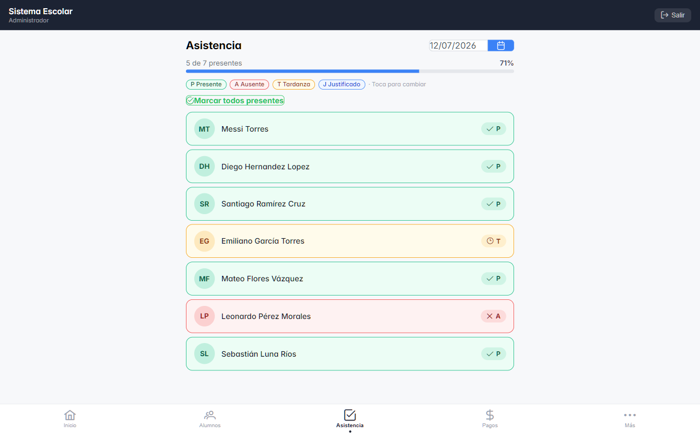
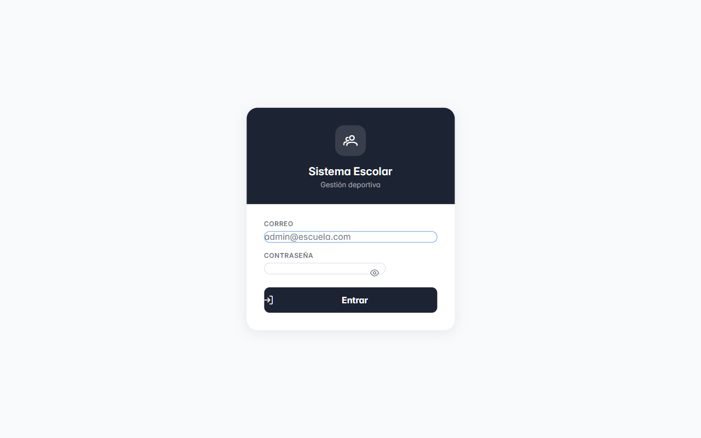
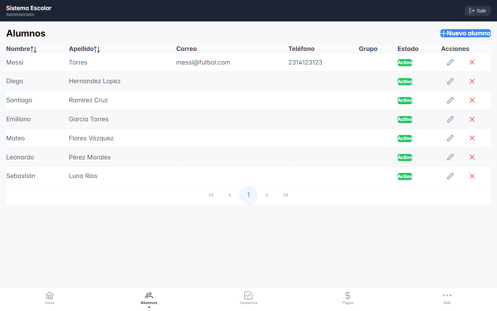

# Sistema de Gestión Escolar Deportiva ⚽

Aplicación web completa para administrar una escuela de fútbol real (Academia
Furia Roja, Teziutlán): alumnos, pase de lista, cobros mensuales y
recordatorios de pago, con control de acceso por roles.

**Stack:** React 18 + Vite + PrimeReact + Redux Toolkit · Spring Boot 3 +
Spring Security (JWT) · MySQL 8

<p align="center">
  
</p>

| Login | Alumnos |
|---|---|
|  |  |

## Qué hace

Tres roles con permisos distintos, revisados en frontend (UX) **y** backend
(seguridad real — el frontend nunca es barrera):

| Rol | Alumnos | Asistencia | Pagos | Usuarios |
|---|---|---|---|---|
| Dueño | ✓ | ✓ | ✓ | ✓ |
| Secretaria | ✓ | — | ✓ | — |
| Entrenador | ✓ | ✓ | — | — |

- **Asistencia:** lista táctil mobile-first pensada para un entrenador pasando
  lista desde el celular — cambio de estado en un toque con **actualización
  optimista** (Redux Toolkit: la UI responde al instante y revierte sola si el
  servidor falla), barra de progreso y "marcar todos presentes".
- **Pagos:** registro de mensualidades con autoría automática desde el token
  JWT (el sistema sabe quién cobró sin preguntarlo).
- **Recordatorios:** cruza alumnos activos contra pagos del mes para mostrar
  quién debe — calculado en el cliente, sin endpoint extra.
- **Alumnos/Usuarios:** CRUD con borrado lógico (un alumno inactivo conserva
  su historial de asistencia y pagos).

## Arquitectura

```
React + Vite (:3000)  ──HTTP/JSON + JWT──▶  Spring Boot (:8080)  ──JPA/SQL──▶  MySQL 8
      UI, roles (UX)         Bearer token       seguridad real,                datos +
      Redux en Asistencia                        DTOs, validación               restricciones
```

Decisiones técnicas documentadas y defendibles:

- **JWT stateless** (`SessionCreationPolicy.STATELESS`) — cualquier réplica del
  backend valida el token sin estado compartido.
- **Patrón DTO en toda la API** — las entidades JPA nunca viajan al navegador
  (ni hashes de contraseña, ni ciclos de serialización Grupo↔Alumno).
- **Upsert seguro de asistencia** — restricción única compuesta
  `(alumno_id, fecha)` en la base de datos respalda al controlador contra
  registros duplicados por condición de carrera.
- **`GlobalExceptionHandler`** — los errores de base de datos responden 409 con
  mensaje real, en lugar de subir hasta el filtro de seguridad y salir
  disfrazados de 403.
- **`ON DELETE CASCADE` vs `SET NULL` por intención** — borrar un alumno borra
  su historial; borrar un usuario **no** borra los pagos que registró.

## Bugs reales diagnosticados y corregidos

No ejercicios de tutorial — bugs encontrados en uso real, con diagnóstico por
logs y verificación en tres niveles (curl, caso negativo, navegador real):

| Bug | Causa raíz | Arreglo |
|---|---|---|
| No se podía guardar un 2.º alumno sin correo | El formulario mandaba `""` y la restricción `UNIQUE` lo trató como valor real duplicado | Normalizar vacío → `NULL` antes de guardar |
| Pago con alumno inexistente fallaba con error confuso | `ifPresent()` ignoraba en silencio el alumno no encontrado | 404 inmediato antes de tocar la base de datos |
| Todo error salía como "sin permiso" (403) | Excepciones de BD sin atrapar subían al filtro de seguridad | `GlobalExceptionHandler` (409 + mensaje real) |

## Correr en local

Requisitos: JDK 17, Maven, Node 18+, MySQL 8 (XAMPP).

```bash
# 1. Base de datos
mysql -u root < database/migrations/01_schema.sql

# 2. Backend (crea roles y usuario admin al arrancar; credenciales por
#    variables de entorno ADMIN_EMAIL / ADMIN_PASSWORD)
cd backend && mvn spring-boot:run

# 3. Frontend
cd frontend && npm install && npm run dev
```

O en Windows: `iniciar.bat` (arranca MySQL, backend y frontend juntos).

## Autor

**Lauro Fernando Valdez Gámez** — Ingeniería en Sistemas Computacionales,
Instituto Tecnológico Superior de Teziutlán.
[LinkedIn](https://www.linkedin.com/in/laurovaldez-37996840a) · [GitHub](https://github.com/Oloracereza)
